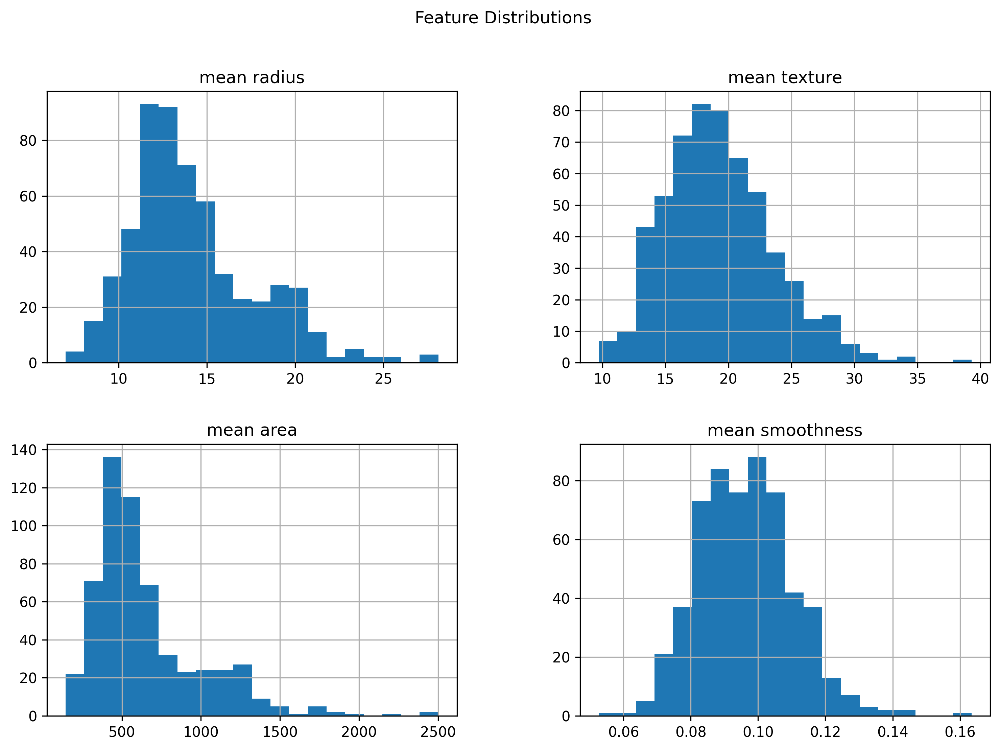
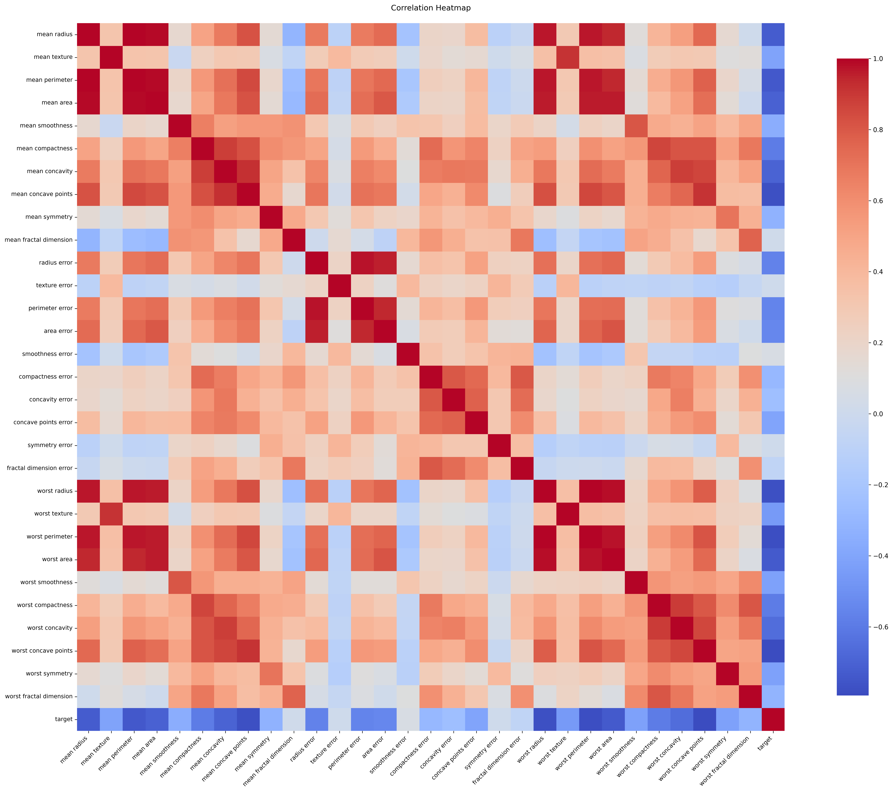
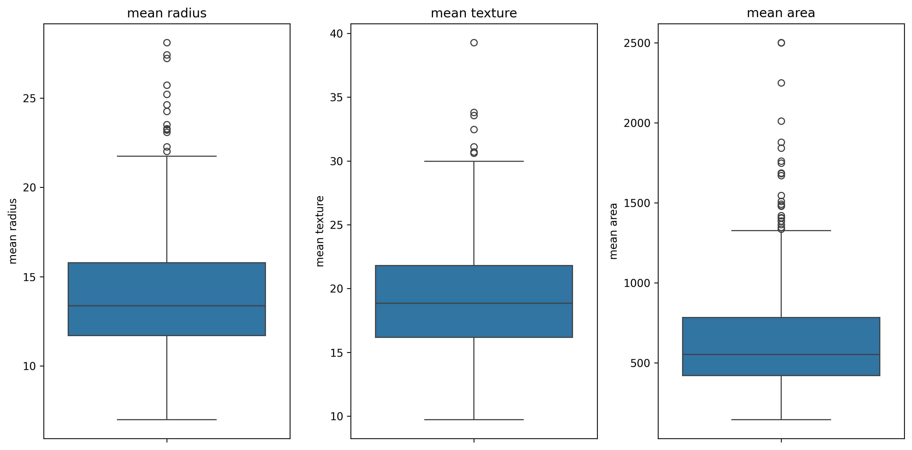
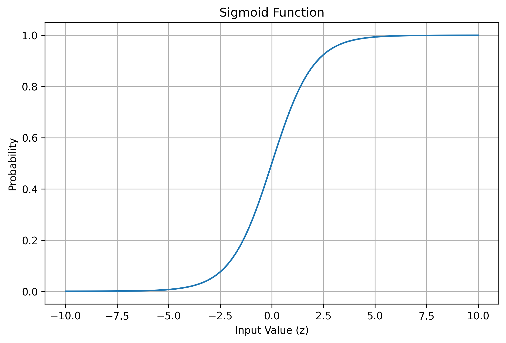
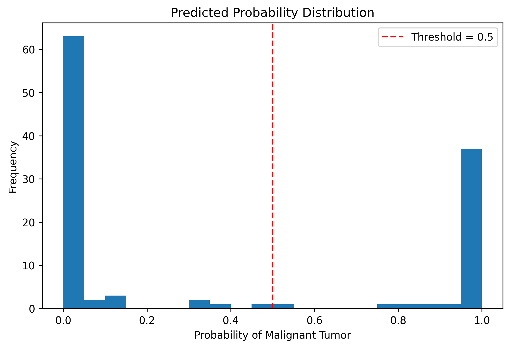
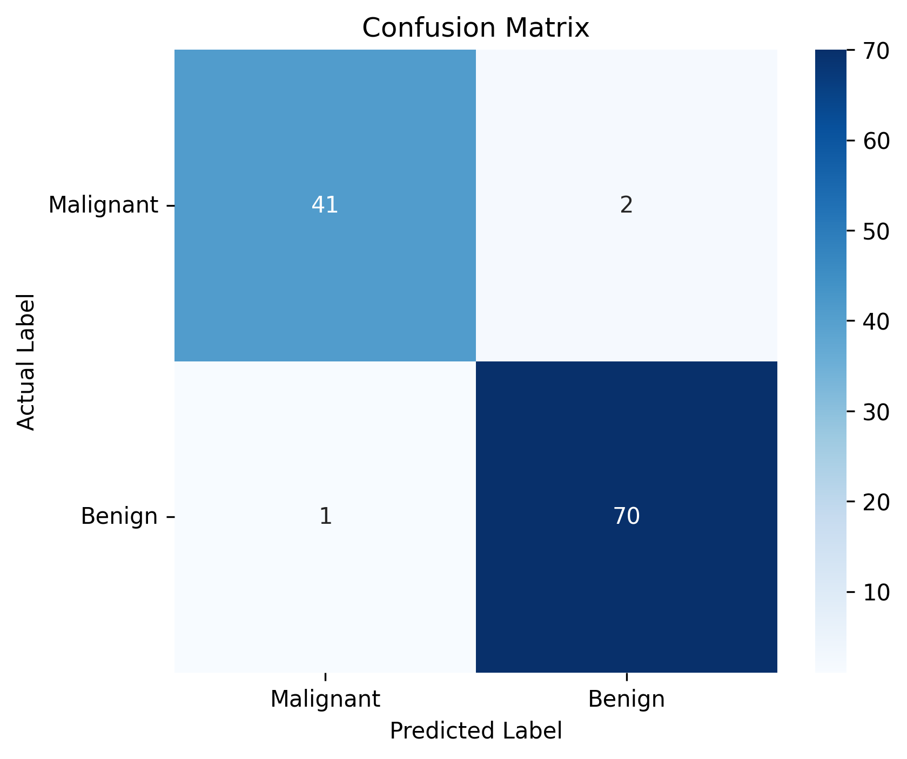

# Assignment 02 — Breast Cancer Classification using Logistic Regression

## Overview

This assignment focuses on understanding the complete Machine Learning workflow for solving a **binary classification** problem using Logistic Regression.

The objective is to explore how Logistic Regression can be used to classify medical observations into different classes by performing data exploration, preprocessing, model training, evaluation, and hyperparameter experimentation.

---

# Areas of Focus

## Dataset Understanding

- Understanding dataset structure
- Exploring target class distribution
- Identifying feature characteristics
- Analyzing dataset statistics

## Exploratory Data Analysis (EDA)

- Class distribution analysis
- Feature distribution analysis
- Correlation analysis
- Outlier detection
- Data visualization

## Data Preprocessing

- Train-Test Split
- Feature Scaling using StandardScaler
- Preparing data for Logistic Regression

## Logistic Regression Modeling

- Binary Classification
- Model Training
- Coefficient Interpretation
- Decision Boundary Concepts

## Model Evaluation

- Accuracy
- Confusion Matrix
- Precision
- Recall
- F1-Score
- Classification Report

## Hyperparameter Experimentation

- Regularization Strength (C)
- Model Performance Comparison
- Selecting the Best Performing Model

---

# Learning Objectives

Through this assignment, the focus is on developing understanding of:

- End-to-End Classification Workflow
- Binary Classification Problems
- Logistic Regression Fundamentals
- Importance of Feature Scaling
- Classification Performance Metrics
- Hyperparameter Tuning

---

# Tools & Technologies

- Python
- Pandas
- NumPy
- Matplotlib
- Seaborn
- Scikit-learn
- Jupyter Notebook

---

# Repository Structure

```text
02-logistic-regression/
│
├── assignment-question/
│   └── problem-statement.md
│
├── code/
│   └── breast_cancer_logistic_regression.py
│
├── dataset/
│   └── README.md
│
├── images/
│
├── notebook/
│   └── breast_cancer_logistic_regression.ipynb
│
├── notes/
│
└── README.md
```

---

# Sample Visualizations

The following visualizations were generated during Exploratory Data Analysis (EDA) and model evaluation.

## Class Distribution



---


## Correlation Heatmap



---

## Outlier Detection



---

## Sigmoid Function



---

## Predicted Probability Distribution



---

## Confusion Matrix



---

# Key Takeaways

- Successfully implemented a complete binary classification workflow using Logistic Regression.
- Performed Exploratory Data Analysis (EDA) to understand feature distributions and class balance.
- Applied feature scaling using **StandardScaler** to improve model performance.
- Evaluated the model using Accuracy, Precision, Recall, F1-Score, Confusion Matrix, and Classification Report.
- Compared multiple regularization strengths (`C`) to identify the best-performing Logistic Regression model.

---

# Status

✅ Completed

**Module:** Core Machine Learning

**Algorithm:** Logistic Regression

**Type:** Binary Classification